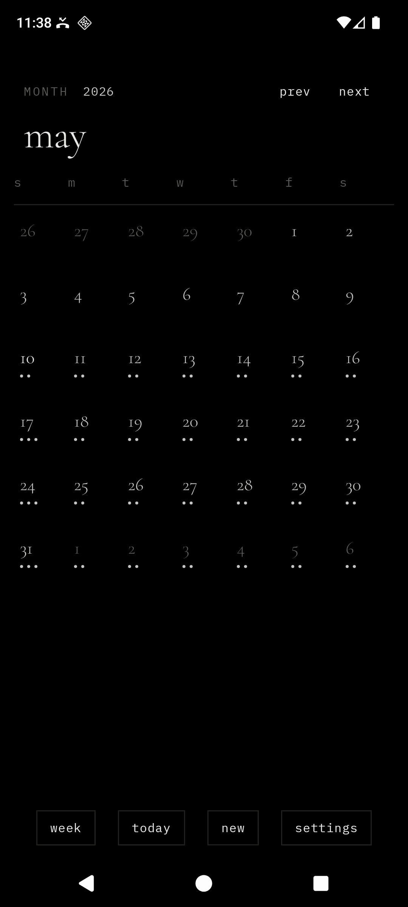
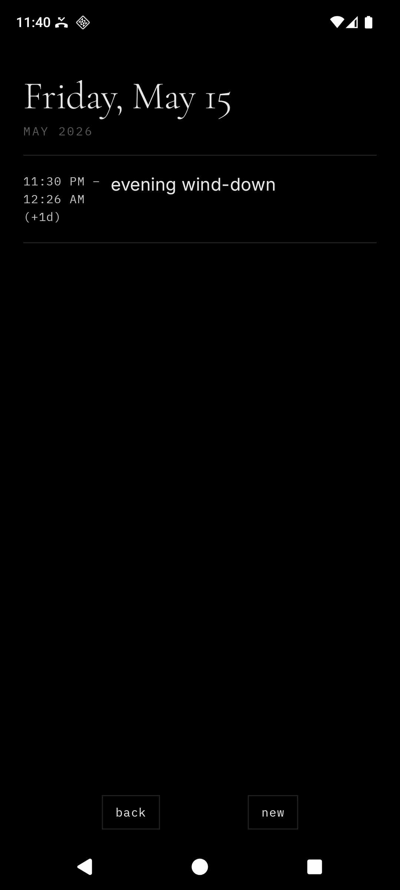
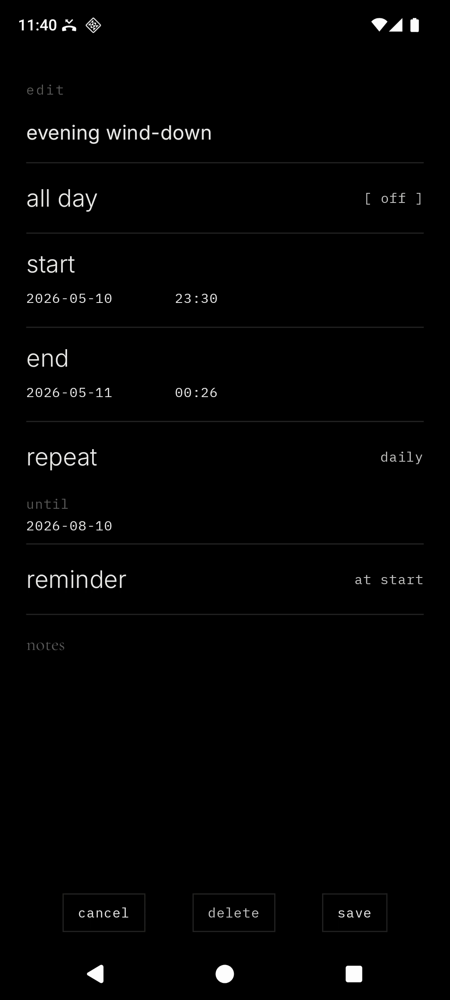
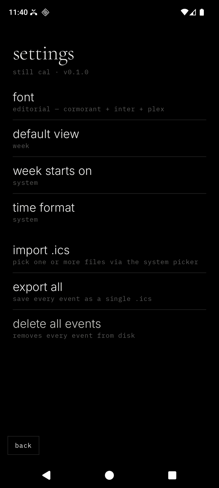

<div align="center">

# Still Cal

#### A quiet calendar for Android.

part of the [still](STILL.md) family. the pact governs every line of code in this repo.

<br>

&nbsp;&nbsp;&nbsp;

<br>

</div>

---

Still Cal is a minimalist, privacy-first Android calendar. It is monochrome, OLED-first, text-first, and designed to feel like the calendar app a beautiful dumb phone would ship if it had a touchscreen. It is the companion to [Still](../still-launcher) and [Still Notes](../still-notes) — same temperament, same fonts, same refusal to phone home.

It declares no internet permission. It ships no analytics. It depends on neither Firebase nor Google Play Services. Events are plain `.ics` files in app-private storage, parsed by an in-house iCalendar parser — no third-party calendar library. It runs on any Android device from API 26 up.

## What Still Cal does

- A **month grid** as the home screen: 7 columns × 6 rows, day numbers in serif, today emphasized, days with events show one to three hairline dots underneath the number.
- A **week view** toggle: a 7-day strip with each day's events listed as `HH:mm  title` rows underneath.
- A **day list**: tap any day in the month grid to open a chronological list of that day's events. All-day events float to the top.
- An **event editor** as a single scrollable column. Title, all-day toggle, start, end, repeat, reminder, notes — view and edit on the same screen.
- **Recurrence**, deliberately small: `daily / weekly / monthly` with a fixed `until` date. No exceptions, no by-day-of-month surgery — if you want an irregular pattern, make more events.
- **Reminders**: per-event, optional, expressed as a single offset (`at start`, `5 min before`, `15 min`, `1 hour`, `1 day`). Fired locally via `AlarmManager.setExactAndAllowWhileIdle`. Recurring events lazily schedule the next alarm from inside the broadcast receiver, so we never enumerate thousands of alarms.
- **Import and export** through the Storage Access Framework: pick `.ics` files into the calendar, export a single event or the entire calendar as one `.ics`. No app-defined storage location.
- **System share-in**: another app can hand a `.ics` to Still Cal via `ACTION_VIEW` (`text/calendar`); the events inside are imported and the user lands on whichever month contains the first one.
- Font presets shared with the launcher and notes: **System** (serif + sans + mono), **Editorial** (Cormorant + Inter + Plex), **Terminal** (Plex Mono throughout), **Grotesk** (Instrument Serif + Space Grotesk).

## The .ics subset, deliberately small

The parser is hand-written and intentionally narrow. Each event on disk is a complete `VCALENDAR` envelope wrapping a single `VEVENT` — so `cat events/*.ics` is human-readable and `events/<id>.ics` round-trips losslessly between writer and parser. We tolerate (but ignore) anything beyond:

- `UID`, `DTSTAMP`, `DTSTART`/`DTEND` (zoned or `VALUE=DATE`), `SUMMARY`, `DESCRIPTION`.
- `RRULE` limited to `FREQ=DAILY|WEEKLY|MONTHLY` plus `UNTIL` (date or UTC datetime) or `COUNT`.
- One `VALARM` per event, `ACTION:DISPLAY`, `TRIGGER` as `-PTnM` / `-PTnH` / `-PnD` / `PT0M`.

`EXDATE`, `BYDAY`, `RECURRENCE-ID`, attendees, organizers, and attachments are silently dropped. The corollary: a folder of Still Cal's `.ics` files dropped into Google Calendar, Fastmail, or Fossify Calendar will round-trip cleanly — there is no proprietary dialect.

Block-level parsing, type mapping, and writing are split across `IcsLexer.kt`, `IcsParser.kt`, `IcsTypes.kt`, and `IcsWriter.kt`. A round-trip unit test under `app/src/test/` asserts that writer → parser → writer is byte-identical for three synthetic events covering zoned single, all-day single, and recurring-with-reminder shapes.

## What Still Cal refuses to do

- **No CalDAV.** No Google sync. No Exchange. No "tap to connect." No account flows of any kind.
- **No attendees, no invitees, no organizers, no RSVPs.** An event has a title, a time, and optional notes.
- **No attachments, no color tags, no categories.** The event row is text.
- **No recurrence-with-exceptions, no `EXDATE`, no `BYDAY` lists.** A one-week gap in the middle of a recurring event is one delete plus two new events.
- **No multi-day spanning blocks in the month grid.** A 3-day event renders as one dot on each of the three days; the day list and week view show the full range.
- **No widgets, no quick-add tile, no notification listener, no accessibility service.**
- **No third-party iCalendar library.**
- **No `INTERNET`, no `QUERY_ALL_PACKAGES`, no `MANAGE_EXTERNAL_STORAGE`.**
- **No `+` button.** New events are reached via a footer verb.

## What it asks for honestly

Three permissions are unavoidable for a calendar with reminders. The notification runtime permission is requested at the moment it matters; exact-alarm access is checked when reminders are saved. None touches the network.

| Permission | Why it's there |
| --- | --- |
| `POST_NOTIFICATIONS` | Android 13+ runtime requirement to surface a reminder notification. Asked the first time a reminder is enabled on an event. |
| `SCHEDULE_EXACT_ALARM` | Android 12+ special access for exact reminder delivery. If the user revokes it, Still Cal warns at save time and uses the platform's inexact idle-tolerant alarm rather than dropping the reminder. |
| `RECEIVE_BOOT_COMPLETED` | `AlarmManager` forgets every scheduled alarm across reboots; without this, tomorrow's 9am reminder dies after tonight's reboot. |

## Privacy posture, in code

| File | What it guarantees |
| --- | --- |
| `app/src/main/AndroidManifest.xml` | No `INTERNET`. Only the three reminders permissions above. One `ACTION_VIEW` intent-filter for `text/calendar` share-in. |
| `app/src/main/res/xml/data_extraction_rules.xml` | Excludes every sharedpref / file / database domain from cloud backup and device transfer. |
| `app/build.gradle.kts` | Dependencies only on AndroidX, Compose, and DataStore — no Firebase, no GMS, no analytics SDK, no iCalendar library. |

## Architecture

```text
MainActivity
└── StillCalApp                          single-Activity Compose shell, hand-rolled router
    ├── EventsRepository                 .ics files on disk + JSON index
    ├── PreferencesRepository            DataStore — font preset, default view, week start, time format
    ├── IoActions                        SAF read/write, ACTION_VIEW import, bulk .ics export
    ├── ical
    │   ├── IcsLexer                     line unfolding (RFC 5545 §3.1)
    │   ├── IcsParser                    BEGIN/END block recognition → RawVEvent
    │   ├── IcsTypes                     RawVEvent → Event (DTSTART/DTEND/RRULE/VALARM)
    │   └── IcsWriter                    Event → .ics, line folding, escaping
    ├── reminders
    │   ├── RemindersScheduler           compute next occurrence, AlarmManager calls
    │   ├── ReminderReceiver             notification + schedule the following occurrence
    │   └── BootReceiver                 BOOT_COMPLETED → reschedule everything
    └── Compose surfaces
        ├── MonthScreen                  7×6 grid, dot per event-day, swipe to advance month
        ├── WeekScreen                   7 rows, events stacked, swipe to advance week
        ├── DayListScreen                chronological events for a date
        ├── EventEditScreen              single scrollable form (view == edit)
        └── SettingsScreen               font, default view, week start, time format, import/export
```

Kotlin, Jetpack Compose, AGP 9.2.1, Gradle Kotlin DSL. Events are stored as `<uuid>.ics` in `filesDir/events/` plus a single `events_index.json` for fast grid rendering. Navigation Compose is intentionally avoided; a small sealed-class router lives in `StillCalApp.kt`. Index entries are encoded as JSON via `org.json` (no extra serialization dependency). Recurrence expansion is computed on demand — we never persist enumerated occurrences. SAF flows go through `ActivityResultContracts`; Still Cal never holds a URI past the system picker callback.

## Gestures

| Gesture | Effect |
| --- | --- |
| Tap a day cell (month) | Open the day list for that date |
| Tap an event row (day list / week) | Open the event editor for that occurrence |
| Long-press an event row (day list) | Action sheet — edit, delete |
| Swipe left/right (month) | Advance / retreat one month |
| Swipe left/right (week) | Advance / retreat one week |
| Tap `today` | Snap to the current date in whichever view |
| Tap `month` / `week` | Toggle views |
| System back | One step back along the route stack |

## Design language

- OLED black background. Soft white primary text. Gray secondary text. Hairline `#232320` dividers.
- Serif for titles, day numbers, the month header. Sans-serif for body and menu rows. Monospace for kickers, captions, time stamps.
- Lowercase for verbs (`new`, `today`, `save`, `delete`, `cancel`, `back`, `import`, `export`). Title case only when the user typed it themselves.
- No ripple. Fade-only transitions. No bouncy motion. No accent color.
- Today's day-cell number is `SoftWhite` — typographic emphasis only, no circle, no chip.
- Event-day dots are `MutedWhite`, 3dp diameter, 4dp gap, capped at three.
- All four font presets (System, Editorial, Terminal, Grotesk) shipped — same set as Still Notes.

## Build and install

Requirements: **JDK 17**, the **Android SDK** with `platforms;android-36` and `build-tools;36.0.0`. The Gradle wrapper (9.4.1) is bundled.

```bash
./gradlew assembleDebug
adb install -r app/build/outputs/apk/debug/app-debug.apk
```

A round-trip unit test for the .ics parser runs via:

```bash
./gradlew :app:testDebugUnitTest
```

The app appears as **still cal** in the launcher.

## Notes for GrapheneOS

Still Cal depends on no part of Google Play Services. It declares only the three reminders permissions and does not touch the network. SAF import/export uses the system documents UI, so where files are written on disk depends on your storage scope policy — Still Cal never asks for `MANAGE_EXTERNAL_STORAGE` or any media permission.

## Status

MVP. Builds against AGP 9.2.1 / Kotlin 2.3.21 / `compileSdk 36`. Unit tests cover the parser round-trip. The custom typographic numeric date/time picker (spec §6.6) is deferred to v0.2 per the documented fallback — v0.1 ships with constrained digit-input `BasicTextField`s. End-to-end verification on a Pixel 8a Android 36 AOSP emulator is the next step in the punch list.

## License

MIT. See [`LICENSE`](LICENSE).
